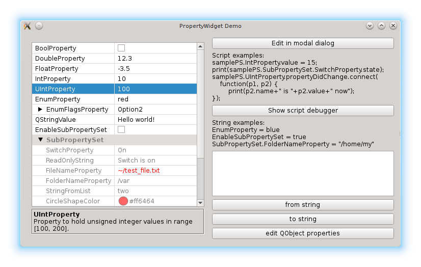

#QtnProperty
This is user and programmist friendly properties in Qt
#Overview
There are some limitations of standard Qt property system.
This project is an attempt to make better properties for programmist and user.
The key features are:

* Properties hierarchy (properties can be organized in hierarchy at any depth)
* Property widget to observe and edit properties in uniform way
* Signals before and after property has changed
* Property description - short text which help user to understand meaning and purpose of the property
* Property state - property can be disabled or hidden at any moment
* Serialization via QDataStream
* Set/Get property value to QVariant and QString
* Scripting support
* Delegates to customize look and feel properties in property widget
* PEG (property/enum generator) - it's tool like Qt moc which generates properties hierarchy from JSON like files.

This is screenshot of the Demo application:

#How to build
**Requirements:**

1. Qt5 framework
2. Flex 2.5.37 and Bison 2.7 (for windows can be found [here](http://sourceforge.net/projects/winflexbison/))

**To build:**
  
    mkdir path_to_build
    cd path_to_build
    qmake path_to_Property_pro_file -r
    make

Libraries and executables will be placed in 'path\_to\_build/bin' folder.
  
**To run tests and demo:**

    cd path_to_build/bin
    ./QtnPropertyTests
    ./QtnPropertyDemo

QtnProperty project consisit of five submodules:

1. **QtnPropertyCore** library - property classes (non GUI stuff)
2. **QtnPropertyWidget** library - QtnPropertyWidget, QtnPropertyView and property delegates (GUI stuff)
3. **QtnPEG** tool - executable to generate C++ classes which represent property sets from simple JSON like files (*.pef files)
4. **QtnPropertyTests** - tests for QtnPropertyCore library
5. **QtnPropertyDemo** - demo application

#How to use

1. Write pef file with propertyset declaration (for example )
  
    \#include "Core/PropertyCore.h"
    
    property_set TextEditorParams
    {
        Bool enableWrapping
        {
            description = "Enable/disable text wrapping";
            value = true;
        }
        
        Bool replaceTabsWithSpaces
        {
            description = "Automatically replace tabs with spaces";
            value = false;
                
            slot propertyDidChange
            {
                tabSize.switchState(QtnPropertyStateImmutable, !replaceTabsWithSpaces);
            }
        }
        
        UInt tabSize
        {
            description = "Number of spaces to be placed.";
            state = QtnPropertyStateImmutable;
            value = 4;
        }
    }
    
2. Generate C++ classes by running command
  
    QtnPEG TextEditorParams.pef
    
3. Include generated TextEditorParams.peg.h and TextEditorParams.peg.cpp files to 
your project.
4. Now you can use QtnPropertySetTextEditorParams class (defined in generated files) in your code like this:

        QtnPropertySetTextEditorParams params;
        params.enableWrapping = false;
        if (params.replaceTabsWithSpaces)
            replaceTabsWithSpaces(text, params.tabSize);

